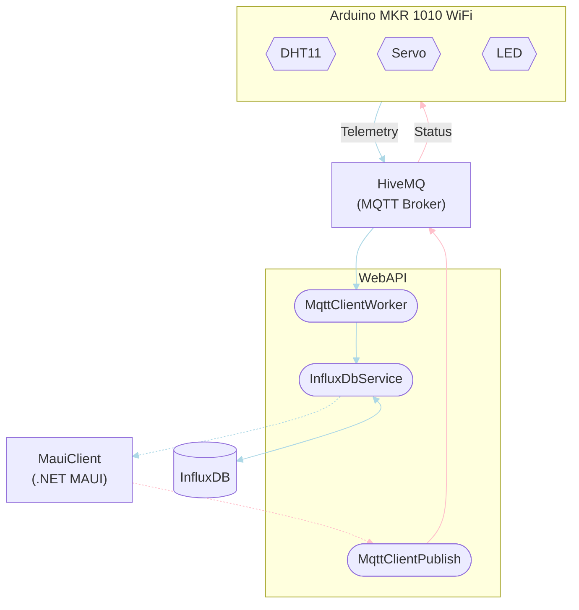

# IoT_TelemetryProject

## Requirements
- [ ] Display last humidex meassurement and time of measurement in lokal time.
- [ ] Display a graph over humidex measserments with selectable time interval.
- [ ] Control servo position.
- [ ] Control LED state.
- [x] Use MVVM design pattern with DI. 
- [ ] Show last received data when the internet connection is down.
- [x] Resilient against unstable network connections.
- [ ] *Meassurement sessions.* 
- [ ] Set min. and max. humidex values and get notified when the range is exceeded.

## Architecture
Here, the flow between all parts (both *in* and *outside* (i.e. HiveMQ and InfluxDB) this repository) is depicited with a flow diagram. In order to keep the diagram simple, descriptions of what's inferred to with for instance 'Telemetry' can be found below the diagram along with a full description of the entire flow.



### Telemetry
Telemetry data is sent via all the **light blue** links. The telemetry data is a humidex (temperature and humidity) messured by the DHT11 sensor attached to the Arduino board.

1. The Arduino publishes an MQTT message with a JSON object as the payload to the topic; `arduino/dht/humidex`.
2. The `MqttClientWorker` running as a background service within the web API is subscribed to the `arduino/dht/humidex` topic. It recieves the MQTT message as the broker (HiveMQ) relays it to all subscribers.
3. If the payload of the message can be correctly parsed as a `Humidex` object, the web API marks it with a timestamp and sends it of to be stored in an external InfluxDB via the `InfluxDbService`.
4. Once humidex data is requested (i.e. from the MauiClient) using a `GET` endpoint, it is queried from the InfluxDB and responded with to the requesting client.

### Status
Status is sent via all the **pink** links. In the context of this project *status* is communication for controlling the LED and servo attached to the Arduino board (see [MQTT Payloads](#mqtt-payloads)).

1. Once a client (i.e. from the MauiClient) uses a `POST` endpoint to send status information, an MQTT message with a payload equivalent to the `POST` method is created.
2. Using the `MqttClientPublish` class, the web API publishes the MQTT message to the topic; `arduino/led`, `arduino/servo`, or just `arduino/status` (see [Known Limitations & Issues](#known-limitations-issues)).
3. The Arduino is subscribed to all the topics of the previous step and will resultingly receive the message, read the topic and payload, and act accordingly.

## API Overview
| API                                  | Description                                        | Request body | Reponse body       | Codes    |
|--------------------------------------|----------------------------------------------------|--------------|--------------------|----------|
| `POST /servo/{position}`             | Set the servo position (0-180 degrees)             | None         | None               | `200 OK` |
| `GET /humidex`                       | Get all humidexes                                  | None         | Array of humidexes | `200 OK` |
| `GET /humidex/{startTime}/{endTime}` | Get all humidexes between a specific time interval | None         | Array of humidexes | `200 OK` |

## MQTT Payloads
### Topic: `arduino/dht/humidex`
This is where the Arduino board publishes the telemetry data. The `MqttClientWorker` running in the background of the web API is subscibed to this topic and will store the received data in the InfluxDB using the `InfluxDbService`.
``` JSON
{
  "Temperature": 12.34,
  "Humidity": 12.34
}
```

### Topic: `arduino/led`
The Arduino board is subscribed to this topic. If the payload equals "on" the LED will turn on. Likewise, if the payload equals "off" it will turn off.
```
on
```

### Topic: `arduino/servo`
The Arduino board is subscribed to this topic. It will attempt to parse the payload as an integer and set the servo position to this value. The range is **0** to **180** degrees.
```
123
```

## Usage

## Known Limitations & Issues
* The current implementation of the project only allows for controlling and monitoring a single Arduino board. Connecting to multiple boards is outside the scope of this project. However, it could be accomplished by assigning an ID to each board and then include it in the payload of the MQTT messages targeted towards specific boards. When using Azure IoT Hub, the embedded application is already able to receive messages of the following format.
    ``` JSON
    {
      "led": "on",
      "servo": 123
    }
    ```
    When using the raw MQTT implementation, the program could be updated to use message payloads like the one below. This could be published to the `arduino/status` topic. Each board will then be able to react only messages assigned with its ID.
    ``` JSON
    {
      "ids": [ "01", "02" ],
      "led": "on",
      "servo": 123
    }
    ```
    Furthermore, the format for storing humidex measurements would have to be reconsidered, as each measurement must be back traceable to the board it originated from. This would likely be overcome by including a board ID record for all measurements or even creating multiple buckets (one for each board) in InfluxDB.

### Web API
* In the `ReadAllHumidex(DateTime startTime, DateTime endTime)` method of the `InfluxDbService`, records are not filtered by date and time during the database query. This only happens after all the data has been queried. Therefore, poor performance is to be expected.

## Versioning
TODO
