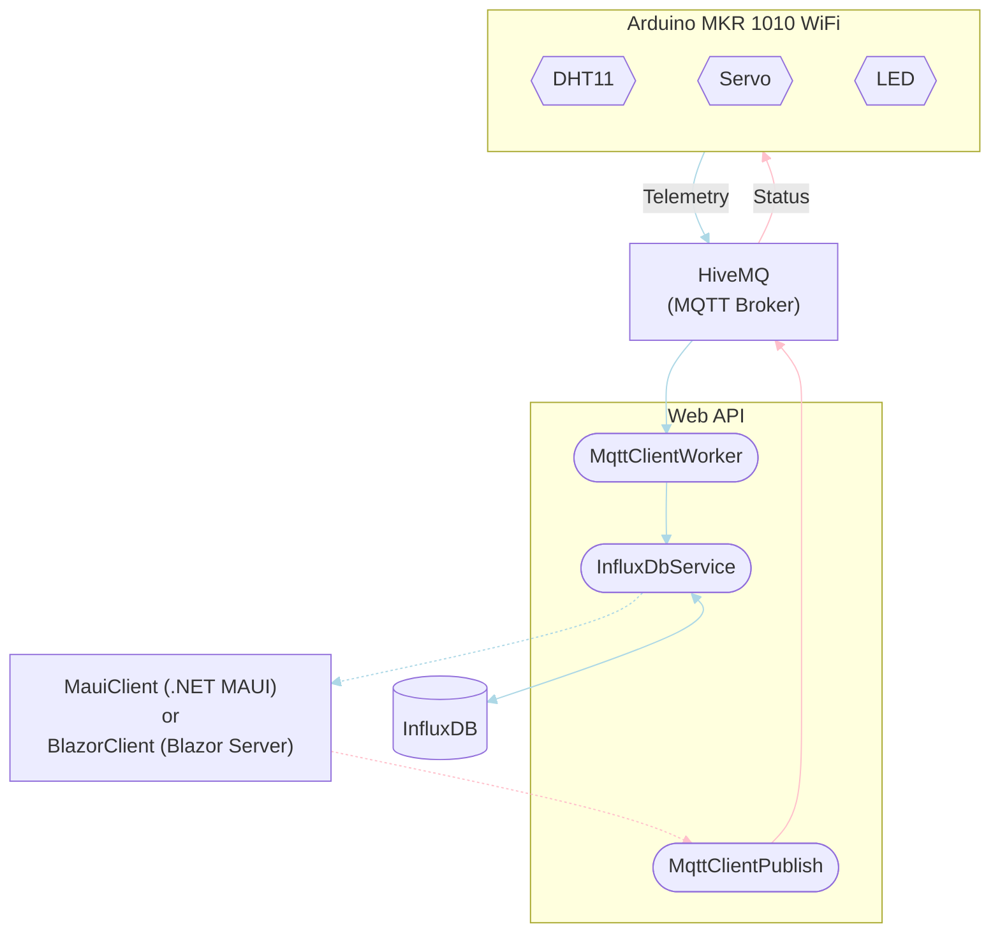

# TelemetryProject
This project demonstrates how both telemetry, state, and configuration data tied to an IoT device can be viewed and communicated across networks from a user client application. Key technologies and services used are:
* **MQTT** with HiveMQ as the broker.
* **InfluxDB** for storing telemetry data.
* **.NET MAUI** and **Blazor Server** for the client applications.
    * **Polly** for resilience.
	* **SignalR** for server to client communication.
* **.NET minimal API** for bridging all of the above.

## Requirements
- [x] Display last humidex measurement and time of measurement in local time.
- [x] Display a graph over humidex measurements with selectable time interval.
- [x] Control servo position.
- [x] Control LED state.
- [x] Use MVVM design pattern with DI (only .NET MAUI).
- [x] Show last received data when the internet connection is down.
- [x] Resilient against unstable network connections.
- [x] Live measurement sessions.
- [ ] Set min. and max. humidex values and get notified when the range is exceeded.
- [x] Run all server applications in Docker.

## Architecture
Here, the flow between all parts (both in- and outside this repository; i.e. HiveMQ and InfluxDB) is depicted with a flow diagram. In order to keep the diagram simple, descriptions of what's inferred to with for instance 'Telemetry' can be found below the diagram along with a full description of the entire flow.



### Telemetry
Telemetry data is sent via all the **light blue** links. The telemetry data is a humidex (temperature and humidity) measured by the DHT11 sensor attached to the Arduino board.

1. The Arduino publishes an MQTT message with a JSON object as the payload to the topic; `arduino/dht/humidex`.
2. The `MqttClientWorker` running as a background service within the web API is subscribed to the `arduino/dht/humidex` topic. It recieves the MQTT message as the broker (HiveMQ) relays it to all subscribers.
3. If the payload of the message can be correctly parsed as a `Humidex` object, the web API marks it with a timestamp and sends it of to be stored in an external InfluxDB via the `InfluxDbService`.
4. Once humidex data is requested (e.g. from the MauiClient) using a `GET` endpoint, it is queried from the InfluxDB and responded with to the requesting client.

### Status
Status is sent via all the **pink** links. In the context of this project *status* is communication for controlling the LED and servo attached to the Arduino board (see [MQTT Payloads](#mqtt-payloads)).

1. Once a client (e.g. from the MauiClient) uses a `POST` endpoint to send status information, an MQTT message with a payload equivalent to the `POST` method is created.
2. Using the `MqttClientPublish` class, the web API publishes the MQTT message to the topic; `arduino/led`, `arduino/servo`, or just `arduino/status` (see [Known Limitations & Issues](#known-limitations-issues)).
3. The Arduino is subscribed to all the topics of the previous step and will as a result; receive the message, read the topic and payload, and act accordingly.

## API Overview
| API | Description | Request body | Reponse body | Codes |
|--------|-------------|--------------|--------------|-------|
| `POST /servo/{position}` | Set the servo position (0-180 degrees) | None | None | `200 OK` |
| `POST /led/{state}` | Turn LED on or off ("on"/"off") | None | None | `200 OK`, *Fake `500 Internal Server Error` 50% of the time* |
| `GET /humidex` | Get all humidexes | None | Array of humidexes | `200 OK` |
| `GET /humidex/{startTime}/{endTime}` | Get all humidexes between a specific time interval | None | Array of humidexes | `200 OK` |
| `GET /humidex/latest` | Get the latest humidex | None | Single humidex | `200 OK`, `404 Not Found` |

## MQTT Payloads
### Topic: `arduino/dht/humidex`
This is where the Arduino board publishes the telemetry data. The `MqttClientWorker` running in the background of the web API is subscibed to this topic and will store the received data in the InfluxDB using the `InfluxDbService`.
``` JSON
{
  "Temperature": 12.34,
  "Humidity": 12.34
}
```

### Topic: `arduino/led`
The Arduino board is subscribed to this topic. If the payload equals "on" the LED will turn on. Likewise, if the payload equals "off" it will turn off.
```
on
```

### Topic: `arduino/servo`
The Arduino board is subscribed to this topic. It will attempt to parse the payload as an integer and set the servo position to this value. The range is **0** to **180** degrees.
```
123
```

## MAUI Client Application (MauiClient)
### Hamburger Menu or Rather; Lack Thereof
The MauiClient doesn't feature a hamburger menu (or flyout) in the top left corner as is sometimes seen in other GUIs. A hamburger menu is great for keeping navigation options close by when screen space is limited. The function of this UI element is also widely understood. However, when hiding information away from the user, it unsurprisingly becomes less visible, thus making it harder to find information at first glance. Moreover, the position in the top left corner makes the menu hard to reach on a mobile phone. Opening a hamburger menu, therefore requires a certain will from the user to go explore options in the UI for themselves.

The MauiClient instead uses a tab bar in the bottom of the screen with icons and text. This keeps navigation options clearly visible and accessible to the user and only requires a single click/tab, whereas a hamburger menu would require at least two in addition to an awkward reach to the top left corner of the screen.

Currently, there aren't enough pages to justify using the build-in 'More' option of the tab bar. However, if there were to become more, this feature would provide the utility of a traditional hamburger menu, while keeping the ease of access a tab bar provides. Essentially, non of the mentioned drawbacks of a hamburger menu are derived as these are overridden by still having a tab bar.

## Blazor Server Application (BlazorClient)
### Auth0
Authentication has been added using [this](https://auth0.com/blog/what-is-blazor-tutorial-on-building-webapp-with-authentication/) guide.

The following steps must be followed before running the Blazor application.

1. Go to your [Auth0 dashboard](https://manage.auth0.com/) and add a new 'Regular Web Application' with an appropriate name.
2. Go to the settings tab of the newly registered application.
    * Take of note of 'Domain' and 'Client ID'.
3. Add `https://localhost:<PORT>/callback` the 'Allowed Callback URLs' and `https://localhost:<PORT>/` to the 'Allowed Logout URLs' replacing `<PORT>` with the port number of the Blazor application.
4. In the [appsettings.json](TelemetryProject.BlazorClient/appsettings.json) file of the BlazorClient project; insert the Auth0 'Domain' and 'Client ID' under the 'Auth0' section.

> The current implementation of Auth0 doesn't play nicely with dev tunnels. Therefore, dev tunnels cannot be used for running the BlazorClient. However, the BlazorClient can communicate with an API running through a dev tunnel without any issues.

## Usage
### General Setup
To get the project running in a new environment, the following steps must be taken.

1. Visit [HiveMQ Cloud](https://www.hivemq.com/mqtt-cloud-broker/); create an account and new a cluster.
    - Take note of 'Cluster URL'.
2. In HiveMQ Cloud; create a new set of access credentials with 'Publish and Subsribe' permission and note down the 'Username' and 'Password'.
3. Visit [InfluxDB Cloud](https://www.influxdata.com/products/influxdb-cloud/); create an account, an organization, and a new bucket.
    - Take note of 'Organization ID', bucket name, and 'Cluster URL (Host Name)'.
4. In InfluxDB Cloud; create a new 'All Access API Token' and note it down.
5. In the [appsettings.json](TelemetryProject.WebApi/appsettings.json) file of the WebApi project; insert all information from the above.
6. Verify the [embedded hardware](#embedded-hardware).
7. In the [arduino_secrets.h](TelemetryProject.Arduino/include/arduino_secrets.h) file found in the 'include' directory of the embedded application; insert HiveMQ information in all the macro definitions stating with "BROKER_HIVE_MQ".
8. Again in the [arduino_secrets.h](TelemetryProject.Arduino/include/arduino_secrets.h) file; insert WiFi SSID and password (`SECRET_SSID` and `SECRET_PASSWORD`) for the network the Arduino board will be connecting to.
9. Start the web API (WebApi).
10. Start the Arduino and wait for it to connect to the MQTT broker. The tricolor LED will turn green upon connection establishment.

### *using MAUI*
11. Start the MAUI application (MauiClient).

### *using Blazor*
11. Follow the steps to setup [Auth0](#auth0).
12. Start the Blazor application (BlazorClient).

### Embedded Hardware
The embebbed code is designed and tested to run on an Arduino MKR 1010 WiFi with a DHT11 and servo connected. When using the default pin configuration of the embedded program, the peripherals should be connected as described below.

* DHT11: D1 (PA23)
* Servo: D3 (PA11)

### Host in a Dockerized Environment on a Raspberry Pi 4
#### Prepare and Connect to the Raspberry Pi
1. Flash Raspberry Pi Lite (64-bit) onto a MicroSD card using [Raspberry Pi Imager](https://www.raspberrypi.com/software/).
    1. Set Raspberry Pi hostname. The hostname will become; '\<your input>.local'.
    2. Enable SSH with password authentication.
    3. Set username and password.
    4. Configure WLAN (Upon enabling, information of the current WLAN will be filled in).
    5. Set WLAN country and other locale settings.
    6. Uncheck 'Enable telemetry' at the bottom.
2. Eject, the MicroSD card, insert it into the Raspberry Pi, and boot from the new image.
3. Once the Raspberry Pi is powered up, use a computer on the same LAN to establish an SSH connection; `ssh <username>@<Raspberry Pi IP/hostname>`.

> Default Raspberry Pi hostname: `raspberrypi.local`.
> Custom Raspberry Pi hostname: `<name>.local`)

4. Update the Raspberry Pi: `sudo apt-get update && sudo apt-get upgrade`
5. Install Docker and Docker Compose: `sudo apt install docker docker.io docker-compose`
6. Start Docker: `sudo systemctl start docker`
7. Give the user permissions to use Docker: `sudo usermod -a -G docker <username>`
8. Reboot: `sudo reboot`

[This guide](https://code.visualstudio.com/docs/remote/ssh) can be used to connect to the Raspberry Pi 4 (or any other SSH client) from Visual Studio Code.
Note that when you're connected, all your extensions doesn't show in the sidebar anymore. This is because Visual Studio now only shows what's installed on the SSH client.

#### Disable HTTPS Redirection
1. In [Program.cs](TelemetryProject.WebApi/Program.cs) (WebApi) and [Program.cs](TelemetryProject.BlazorClient/Program.cs) (BlazorClient); comment out `app.UseHttpsRedirection();`.

#### Disable Auth0
Auth0 currently needs to be disabled for the BlazorClient to be able to run in the Docker environment.
1. In [Index.razor](TelemetryProject.BlazorClient\Pages\Index.razor) and [Charts.razor](TelemetryProject.BlazorClient\Pages\Charts.razor); comment out line 2: `@attribute [Authorize]`.
2. In [MainLayout.razor](TelemetryProject.BlazorClient\Shared\MainLayout.razor); comment out line 13-18.

#### Setup Kestrel
1. In both [appsettings.json](TelemetryProject.WebApi/appsettings.json) (WebApi) and [appsettings.cs](TelemetryProject.BlazorClient/appsettings.json) (BlazorClient); add the following section.
```json
"Kestrel": {
  "Endpoints": {
    "Http": {
      "Url": "http://0.0.0.0:80"
    }
  }
}
```

#### Enable Swagger
If you wish to use Swagger when running the web API inside Docker, you must modify the WebApi project to enable Swagger outside development environments.

1. In [Program.cs](TelemetryProject.WebApi/Program.cs); move line 28-29 outside of the if statement.
```csharp
app.UseSwagger(); // Add.
app.UseSwaggerUI(); // Add.

if (app.Environment.IsDevelopment())
{
    app.UseSwagger(); // Remove.
    app.UseSwaggerUI(); // Remove.
}
```

#### Docker
##### Setup RabbitMQ
1. Run a RabbitMQ container: `docker run -it -d --name rabbitmq -p 5672:5672 -p 15672:15672 -p 1883:1883 rabbitmq:management`
2. Attach the RabbitMQ terminal: `docker exec -it rabbitmq bash`
3. Enable the MQTT plugin: `rabbitmq-plugins enable rabbitmq_mqtt`

> The RabbitMQ interface can be accessed through a browser on port 15672 (i.e. `<Raspberry Pi IP/hostname>:15672`). The default login is 'guest' as both the username and password.

> MQTT clients can connect to the broker at 'mqtt://<Raspberry Pi IP/hostname>'.

##### Setup InfluxDB
1. Run an InfluxDB container: `docker run -d -p 8086:8086 -v influxdb:/var/lib/influxdb -v influxdb2:/var/lib/influxdb2 influxdb:2.0`
2. Access the web interface at `<Raspberry Pi IP/hostname>:8086`.
3. Create a user and an initial bucket called 'peripherals'.

##### Setup the Web API and BlazorClient
1. Clone/copy the repository to a directory on the Raspberry Pi using Git or a program like WinSCP.
2. In the [appsettings.json](TelemetryProject.WebApi/appsettings.json) file of the WebApi project; insert all relevant information in the `MQTT` and `InfluxDB` sections.
``` JSON
"InfluxDB": {
  "OrganizationId": "<Organization ID>",
  "Bucket": "peripherals",
  "Url": "http://<Raspberry Pi IP/hostname>:8086",
  "Token": "<InfluxDB token with R/W access>"
},
"MQTT": {
  "Address": "mqtt://<Raspberry Pi IP/hostname>",
  "UseTls": false,
  "Username": "guest",
  "Password": "guest"
},
```
> The InfluxDB token can be created using the InfluxDB web interface; under *'Data' - 'Tokens'*. Make sure it has read/write permissions to the 'peripherals' bucket. 
The InfluxDB organization ID will typically be in the url and can otherwise be found under *'Organization' (user icon in the sidebar) - 'About'*.

3. In the [Constants.cs](TelemetryProject.CommonClient/Constants.cs) file of the CommonClient project; set the `ApiBaseUrl` to `http://telemetryproject.webapi/`.
4. Go to the directory of the solution ('./TelemetryProject/') and execute the `docker-compose up` command.

The Web API and BlazorClient can now be accessed at `<Raspberry Pi IP/hostname>:8080` and `<Raspberry Pi IP/hostname>:8081` respectively.

## Known Limitations & Issues
* The current implementation of the project only allows for controlling and monitoring a single Arduino board. Connecting to multiple boards is outside the scope of this project. However, it could be accomplished by assigning an ID to each board and then include it in the payload of the MQTT messages targeted towards specific boards. When using Azure IoT Hub, the embedded application is already able to receive messages of the following format.
    ``` JSON
    {
      "led": "on",
      "servo": 123
    }
    ```
    When using the raw MQTT implementation, the program could be updated to use message payloads like the one below. This could be published to the `arduino/status` topic. Each board will then be able to react to only messages assigned with their ID.
    ``` JSON
    {
      "ids": [ "01", "02" ],
      "led": "on",
      "servo": 123
    }
    ```
    Furthermore, the format for storing humidex measurements would have to be reconsidered, as each measurement must be back traceable to the board it originated from in order to determine which location the measurement is valid for. This would likely be overcome by including a board ID and/or location record for all measurements in InfluxDB.

### WebApi
* In the `ReadAllHumidex(DateTime startTime, DateTime endTime)` method of the `InfluxDbService`, records are not filtered by date and time during execution of the database query. This only happens after all the data has been queried. Therefore, poor performance is to be expected.

### MauiClient
* The client application only runs on Android.

### BlazorClient
* The Blazor specific implementation of `IStorageService`; `LocalStorageService` is currently just a placeholder without any logic. Meaning, it cannot store nor retreive any data. In this specific use-case it is also less important for a server-sided application, which requires a constant connection between the server and client (i.e. internet access from the client device) anyway.

## Video Demonstration
Follow [this link](https://youtu.be/nJfPQxIeF7M) for a quick demonstration of the MauiClient (v1.0.0) in use. The video both shows the app when it's online and offline.

### Offline
All displayed data is stored from previous requests made from the MAUI client before going offline. The client cannot communicate with the API to change servo position or LED state.

The debug window isn't shown as the areoplane mode of the emulator cuts the connection to the IDE too. However, we would have seen that the client doesn't even try to initiate any HTTP communication and resorts to the local cache for data right away.

If the API was offline and the client online, Polly would have retried the request a couple of times before finally giving up and letting the app use the local cache instead.

### Online
We are connected and fully up and running. Polly will retry any failed HTTP messages. Note the "Retrying in xx:xx:xx.x ..." being displayed in the debug window for the POST message to /led/False or /led/True.

## Change Log

### v1.1.1
* Added RabbitMQ configuration options for embedded code.
* Support for Docker and Docker Compose along with guidance for how to set the project up in a dockerized environment on a Raspberry Pi 4.

### v1.1.0
* Added a Blazor Server application.
    * Code shared between the BlazorClient and MauiClient now lives in CommonClient. *This includes but is not limited to code for HTTP and SignalR communication with the API.*
* Aligned namespaces.
* Live measurements using SignalR.
* General bug fixes.

### v1.0.0
* Initial version.
