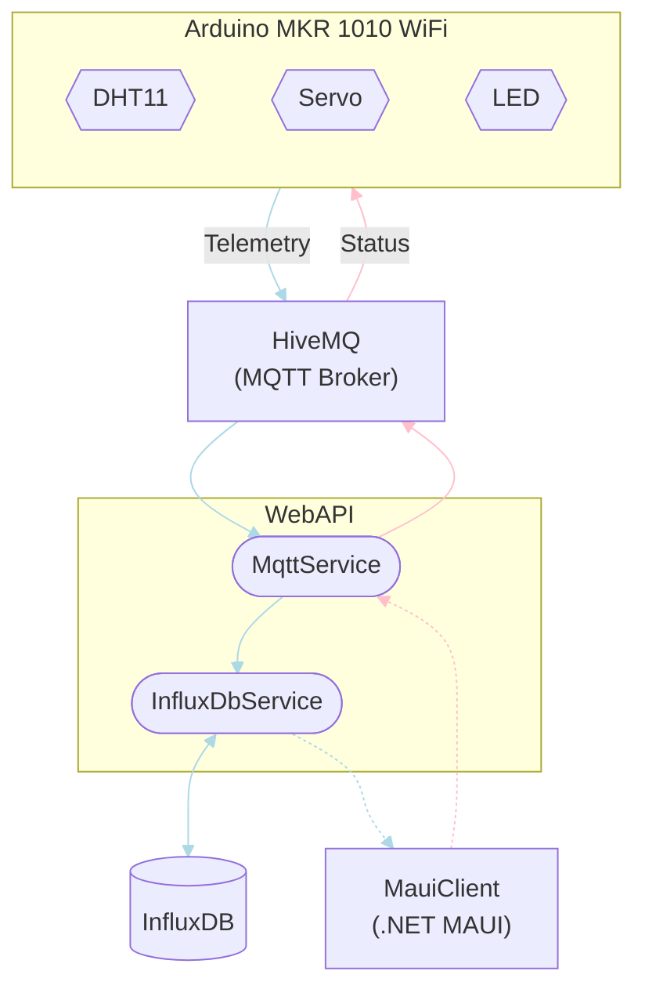

# IoT_TelemetryProject

## Architecture
Here, the flow between all parts (both *in* and *outside* (i.e. HiveMQ and InfluxDB) this repository) is depicited with a flow diagram. In order to keep the diagram simple, descriptions of what's inferred to with for instance 'Telemetry' can be found below the diagram along with a full description of the entire flow.



### Telemetry
Telemetry data is sent via all the **light blue** links. The telemetry data is a humidex (temperature and humidity) messured by the DHT11 sensor attached to the Arduino board.

1. The Arduino publishes an MQTT message with a JSON object as the payload to the topic; `arduino/dht/humidex`.
2. The `MqttService` running as a background service within the web API is subscribed to the `arduino/dht/humidex` topic. It recieves the MQTT message as the broker (HiveMQ) relays the it to all subsribers.
3. If the payload of the message can be correctly parsed as a `Humidex` object, the web API marks it with a timestamp and sends it of to be stored in an external InfluxDB via the `InfluxDbService`.
4. Once humidex data is requested (i.e. from the MauiClient) using a `GET` endpoint, it is queried from the InfluxDB and responded with to the requesting client.

### Status
Status is sent via all the **pink** links. In the context of this project *status* is communication for controlling the LED and servo attached to the Arduino board (see [MQTT Payloads](#mqtt-payloads)).

1. Once a client (i.e. from the MauiClient) uses a `POST` endpoint to send status information, an MQTT message with a payload equivalent to the `POST` method is created.
2. Using the `MqttService` the web API publishes the MQTT message to the topic; `arduino/led`, `arduino/servo`, or just `arduino/status`.
3. The Arduino is subscribed to all the topics of the previous step and will so receive the message, read the topic and payload, and act accordingly.

## API Overview
TODO: Table with all endpoints.

## MQTT Payloads
### Topic: `arduino/dht/humidex`
``` JSON
{
  "Temperature": 12.34,
  "Humidity": 12.34
}
```

### Topic: `arduino/led`
```
on
```

### Topic: `arduino/servo`
```
123
```

### Topic: `arduino/status`
``` JSON
{
  "led": "on",
  "servo": 123
}
```

## Known Limitations & Issues
### Web API
* In the `ReadAllHumidex(DateTime startTime, DateTime endTime)` method of the `InfluxDbService`, records are not filtered by date and time during the database query. This only happens after all the data has been queried. Therefore, poor performance is to be expected.

## Versioning
TODO
